# SpotiFLAC Backend Architecture

This document provides a comprehensive overview of how the SpotiFLAC backend works.

## Architecture Diagram

```mermaid
graph TB
    subgraph "Frontend Layer"
        UI[React/Svelte Frontend]
    end

    subgraph "Wails Bridge"
        WAILS[Wails Runtime<br/>IPC Communication]
    end

    subgraph "App Layer - app.go"
        APP[App Controller]
        APP_FUNCS{Core Functions}
        APP --> APP_FUNCS
        APP_FUNCS --> GET_METADATA[GetSpotifyMetadata]
        APP_FUNCS --> DOWNLOAD[DownloadTrack]
        APP_FUNCS --> SEARCH[SearchSpotify]
        APP_FUNCS --> GET_URLS[GetStreamingURLs]
        APP_FUNCS --> ANALYZE[AnalyzeTrack]
        APP_FUNCS --> CONVERT[ConvertAudio]
    end

    subgraph "Metadata Fetching Layer"
        SPOTIFY_META[SpotifyMetadataClient<br/>spotify_metadata.go]
        SPOTFETCH[SpotFetch Client<br/>spotfetch.go & spotfetch_api.go]
        SPOTIFY_API[Spotify GraphQL API]

        SPOTIFY_META --> |Web Scraping| SPOTIFY_API
        SPOTFETCH --> |API Calls| SPOTIFY_API

        SPOTIFY_META --> PARSE[Parse Spotify URL]
        PARSE --> |Track| FETCH_TRACK[Fetch Track Info]
        PARSE --> |Album| FETCH_ALBUM[Fetch Album Info]
        PARSE --> |Playlist| FETCH_PLAYLIST[Fetch Playlist Info]
        PARSE --> |Artist| FETCH_ARTIST[Fetch Artist Discography]
    end

    subgraph "Service Discovery Layer"
        SONGLINK[SongLink Client<br/>songlink.go]
        SONGLINK_API[song.link API]
        SONGLINK --> |Convert Spotify → Services| SONGLINK_API
        SONGLINK --> GET_TIDAL[Get Tidal URL]
        SONGLINK --> GET_AMAZON[Get Amazon URL]
        SONGLINK --> GET_ISRC[Get ISRC from Deezer]
    end

    subgraph "Download Services Layer"
        TIDAL[TidalDownloader<br/>tidal.go]
        QOBUZ[QobuzDownloader<br/>qobuz.go]
        AMAZON[AmazonDownloader<br/>amazon.go]

        TIDAL --> TIDAL_API[Tidal API<br/>Multiple endpoints]
        QOBUZ --> QOBUZ_API[Qobuz API]
        AMAZON --> AMAZON_API[Amazon Music API]

        TIDAL --> GET_STREAM[Get Stream URL]
        QOBUZ --> SEARCH_ISRC[Search by ISRC]
        AMAZON --> DOWNLOAD_M3U8[Download M3U8/HLS]
    end

    subgraph "Content Enhancement Layer"
        LYRICS[LyricsClient<br/>lyrics.go]
        COVER[CoverClient<br/>cover.go]

        LYRICS --> LRCLIB[LRCLIB API]
        LYRICS --> SPOTIFY_LYRICS[Spotify Lyrics API]
        COVER --> |Download| COVER_IMG[Album/Artist Images]
    end

    subgraph "File Processing Layer"
        METADATA[Metadata Embedding<br/>metadata.go]
        FFMPEG[FFmpeg Operations<br/>ffmpeg.go]
        ANALYSIS[Audio Analysis<br/>analysis.go]
        SPECTRUM[Spectrum Analysis<br/>spectrum.go]

        METADATA --> FLAC_META[FLAC Vorbis Comments]
        METADATA --> MP3_META[ID3v2 Tags]
        METADATA --> EMBED_COVER[Embed Album Art]
        METADATA --> EMBED_LYRICS[Embed Lyrics]

        FFMPEG --> CONVERT_FMT[Convert Audio Format]
        FFMPEG --> EXTRACT_AUDIO[Extract from M3U8/HLS]

        ANALYSIS --> FFPROBE[FFprobe Analysis]
        SPECTRUM --> SPEC_GEN[Generate Spectrograms]
    end

    subgraph "File Management Layer"
        FILENAME[Filename Builder<br/>filename.go]
        FOLDER[Folder Manager<br/>folder.go]
        FILEMGR[File Manager<br/>filemanager.go]

        FILENAME --> |Templates| BUILD_NAME[Build Filename<br/>title-artist, etc]
        FOLDER --> |Sanitize| SAFE_PATHS[Safe File Paths]
        FILEMGR --> |Operations| FILE_OPS[Read/Write/Rename]
    end

    subgraph "Progress & Queue Layer"
        PROGRESS[Progress Tracker<br/>progress.go]
        QUEUE[Download Queue]

        PROGRESS --> TRACK_SPEED[Track Download Speed]
        PROGRESS --> TRACK_PROGRESS[Track Progress %]
        QUEUE --> QUEUE_MGMT[Queue Management<br/>Add/Complete/Fail/Skip]
    end

    subgraph "Storage Layer"
        HISTORY[History Database<br/>history.go]
        CONFIG[Config Manager<br/>config.go]

        HISTORY --> SQLITE[SQLite Database]
        HISTORY --> TRACK_DOWNLOADS[Download History]
        HISTORY --> TRACK_FETCHES[Fetch History]

        CONFIG --> SETTINGS[User Settings<br/>JSON Config]
    end

    subgraph "External Services"
        EXT_SPOTIFY[Spotify]
        EXT_TIDAL[Tidal]
        EXT_QOBUZ[Qobuz]
        EXT_AMAZON[Amazon Music]
        EXT_SONGLINK[SongLink]
        EXT_LRCLIB[LRCLIB]
    end

    %% Main Flow Connections
    UI --> |User Action| WAILS
    WAILS --> |Call Go Functions| APP

    GET_METADATA --> SPOTIFY_META
    GET_METADATA -.->|Optional| SPOTFETCH
    GET_URLS --> SONGLINK

    DOWNLOAD --> |1. Get Service URLs| SONGLINK
    DOWNLOAD --> |2. Download Audio| TIDAL
    DOWNLOAD --> |2. Download Audio| QOBUZ
    DOWNLOAD --> |2. Download Audio| AMAZON
    DOWNLOAD --> |3. Get Lyrics| LYRICS
    DOWNLOAD --> |4. Get Cover| COVER
    DOWNLOAD --> |5. Embed Metadata| METADATA
    DOWNLOAD --> |6. Track Progress| PROGRESS
    DOWNLOAD --> |7. Save to History| HISTORY

    CONVERT --> FFMPEG
    ANALYZE --> ANALYSIS

    %% External API Connections
    SPOTIFY_API -.-> EXT_SPOTIFY
    SONGLINK_API -.-> EXT_SONGLINK
    TIDAL_API -.-> EXT_TIDAL
    QOBUZ_API -.-> EXT_QOBUZ
    AMAZON_API -.-> EXT_AMAZON
    LRCLIB -.-> EXT_LRCLIB

    %% Styling
    classDef frontend fill:#e1f5ff,stroke:#01579b,stroke-width:2px
    classDef app fill:#fff3e0,stroke:#e65100,stroke-width:2px
    classDef service fill:#f3e5f5,stroke:#4a148c,stroke-width:2px
    classDef processing fill:#e8f5e9,stroke:#1b5e20,stroke-width:2px
    classDef storage fill:#fce4ec,stroke:#880e4f,stroke-width:2px
    classDef external fill:#fff,stroke:#666,stroke-width:1px,stroke-dasharray: 5 5

    class UI frontend
    class APP,APP_FUNCS,GET_METADATA,DOWNLOAD,SEARCH,GET_URLS app
    class SPOTIFY_META,SPOTFETCH,SONGLINK,TIDAL,QOBUZ,AMAZON,LYRICS,COVER service
    class METADATA,FFMPEG,ANALYSIS,SPECTRUM,FILENAME,FOLDER,FILEMGR processing
    class HISTORY,CONFIG,PROGRESS,QUEUE storage
    class EXT_SPOTIFY,EXT_TIDAL,EXT_QOBUZ,EXT_AMAZON,EXT_SONGLINK,EXT_LRCLIB external
```



## Core Flow for Downloading a Track

1. **User Input** → Frontend sends Spotify URL/search query
2. **Metadata Fetching** → Extract track info from Spotify
3. **Service Discovery** → Convert Spotify track to Tidal/Qobuz/Amazon URLs via SongLink API
4. **Audio Download** → Download FLAC/ALAC from selected service
5. **Enhancement** → Fetch lyrics and album art in parallel
6. **Processing** → Embed metadata, lyrics, and cover art
7. **Queue Management** → Track download progress and status
8. **History** → Save completed downloads to SQLite database

## Key Components

### Frontend Layer
- **Wails Bridge**: Provides IPC (Inter-Process Communication) between Go backend and web frontend
- **React/Svelte UI**: User interface for interacting with the application

### App Layer (`app.go`)
- **Central Coordinator**: Orchestrates all backend operations
- **API Functions**: Exposes methods to frontend for metadata fetching, downloading, searching, and conversion
- **Request Validation**: Validates and sanitizes user inputs before processing

### Metadata Fetching Layer
- **SpotifyMetadataClient** (`spotify_metadata.go`):
  - Scrapes Spotify's GraphQL API for track/album/playlist/artist data
  - Supports batch fetching for playlists and albums
  - Handles pagination for large collections
- **SpotFetch Client** (`spotfetch.go`, `spotfetch_api.go`):
  - Optional alternative API for Spotify metadata
  - Configurable endpoint for custom SpotFetch instances

### Service Discovery Layer
- **SongLink Client** (`songlink.go`):
  - Converts Spotify URLs to streaming service URLs (Tidal, Amazon, Qobuz)
  - Fetches ISRC codes from Deezer for Qobuz matching
  - Implements rate limiting (9 requests/minute, 7-second delays)
  - Checks track availability across services

### Download Services Layer
- **TidalDownloader** (`tidal.go`):
  - Supports multiple Tidal API endpoints with automatic fallback
  - Downloads HLS/M3U8 streams and extracts to FLAC
  - Handles both direct URLs and Spotify ID-based downloads
- **QobuzDownloader** (`qobuz.go`):
  - ISRC-based track matching
  - Supports quality levels: 5 (MP3 320), 6 (FLAC 16-bit), 7 (FLAC 24-bit), 27 (Hi-Res)
  - Direct FLAC download from Qobuz CDN
- **AmazonDownloader** (`amazon.go`):
  - Downloads from Amazon Music
  - M3U8/HLS stream extraction and conversion

### Content Enhancement Layer
- **LyricsClient** (`lyrics.go`):
  - Fetches synchronized lyrics from LRCLIB
  - Falls back to Spotify's lyrics API
  - Converts to LRC format for embedding
- **CoverClient** (`cover.go`):
  - Downloads album artwork, artist headers, gallery images, and avatars
  - Supports multiple image sizes
  - Downloads highest quality available

### File Processing Layer
- **Metadata Embedding** (`metadata.go`):
  - Embeds metadata into FLAC (Vorbis Comments) and MP3 (ID3v2)
  - Supports: Title, Artist, Album, Date, Track/Disc Numbers, Copyright, Publisher, ISRC
  - Embeds album art and synchronized lyrics
- **FFmpeg Operations** (`ffmpeg.go`):
  - Audio format conversion (FLAC, MP3, ALAC, etc.)
  - M3U8/HLS stream extraction
  - Automatic FFmpeg download and installation
- **Audio Analysis** (`analysis.go`):
  - Uses FFprobe to extract audio metadata
  - Reports: Sample rate, bit depth, bitrate, codec, duration
- **Spectrum Analysis** (`spectrum.go`):
  - Generates audio spectrograms for quality verification

### File Management Layer
- **Filename Builder** (`filename.go`):
  - Template-based filename generation
  - Patterns: `title-artist`, `artist-title`, `track-title`, etc.
  - Sanitizes filenames for cross-platform compatibility
- **Folder Manager** (`folder.go`):
  - Creates organized folder structures
  - Sanitizes folder paths
  - Opens system file explorer
- **File Manager** (`filemanager.go`):
  - File operations: read, write, rename, list
  - Metadata extraction from existing files
  - Batch file processing

### Progress & Queue Layer
- **Progress Tracker** (`progress.go`):
  - Real-time download speed monitoring (MB/s)
  - Progress percentage tracking
  - Thread-safe progress updates
- **Download Queue**:
  - Queue management: Add, Start, Complete, Fail, Skip
  - Status tracking: Queued, Downloading, Completed, Failed, Skipped
  - Session statistics: Total downloaded, start time, counts by status

### Storage Layer
- **History Database** (`history.go`):
  - SQLite database for tracking all downloads and fetches
  - Stores: Track info, file paths, quality, format, timestamps
  - Supports search and filtering
- **Config Manager** (`config.go`):
  - JSON-based configuration storage
  - User settings: Download path, API URLs, preferences
  - Default values and validation

## Supported Services

### Tidal
- Multiple API endpoints with automatic fallback
- HLS stream extraction and FLAC conversion
- Quality levels: LOW, HIGH, LOSSLESS, HI_RES

### Qobuz
- ISRC-based track matching
- Direct FLAC download
- Quality levels: 5 (320 MP3), 6 (FLAC 16-bit), 7 (FLAC 24-bit), 27 (Hi-Res)

### Amazon Music
- M3U8/HLS stream download
- ALAC and FLAC support
- Quality-based stream selection

## Data Flow Example: Downloading a Track

```
1. User pastes Spotify URL → Frontend
2. Frontend calls GetSpotifyMetadata → App Layer
3. App calls SpotifyMetadataClient.GetFilteredData
4. SpotifyMetadataClient fetches track info from Spotify GraphQL API
5. Frontend calls DownloadTrack with track metadata → App Layer
6. App calls SongLinkClient.GetAllURLsFromSpotify
7. SongLinkClient returns Tidal/Amazon URLs
8. App calls TidalDownloader.Download (or selected service)
9. TidalDownloader:
   - Gets track ID from Tidal URL
   - Calls Tidal API for stream manifest
   - Downloads M3U8 stream chunks
   - Uses FFmpeg to convert to FLAC
   - Reports progress via ProgressWriter
10. In parallel:
    - LyricsClient fetches lyrics from LRCLIB/Spotify
    - CoverClient downloads album art
11. App calls EmbedMetadata:
    - Embeds track metadata (title, artist, album, etc.)
    - Embeds album art
    - Embeds synchronized lyrics (if available)
12. ProgressTracker updates download status to Completed
13. HistoryDatabase saves download record
14. Frontend receives success response with file path
```

## External APIs Used

- **Spotify GraphQL API**: Track/album/playlist/artist metadata
- **SongLink API** (song.link): Cross-platform URL conversion
- **Tidal APIs**: Multiple endpoints for stream access
- **Qobuz API**: Track search and download
- **Amazon Music API**: Stream access
- **LRCLIB**: Synchronized lyrics database
- **Deezer API**: ISRC code retrieval

## Technology Stack

- **Language**: Go
- **Framework**: Wails v2 (Go + Web frontend)
- **Database**: SQLite (via go-sqlite3)
- **Audio Processing**: FFmpeg/FFprobe
- **Audio Metadata**:
  - FLAC: go-flac, flacvorbis, flacpicture
  - MP3: id3v2
- **HTTP Client**: net/http with custom timeout and retry logic
- **Concurrency**: Goroutines and channels for parallel operations

## Key Features

- **Multi-service support**: Download from Tidal, Qobuz, or Amazon Music
- **High-quality audio**: FLAC, ALAC, Hi-Res support
- **Complete metadata**: Embeds all track info, lyrics, and artwork
- **Batch downloads**: Playlists, albums, and artist discographies
- **Progress tracking**: Real-time speed and progress monitoring
- **History tracking**: SQLite database for all downloads
- **Audio analysis**: Quality verification with spectrograms
- **Format conversion**: FFmpeg-based audio conversion
- **Cross-platform**: macOS, Windows, Linux support
